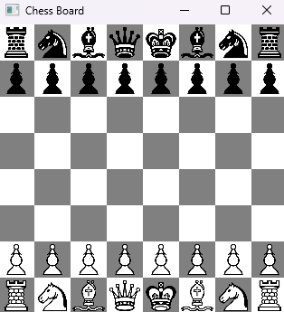

# Java Chessboard Project

# JavaFX Chessboard

## Overview
This project creates a graphical chessboard using JavaFX.

## Features
- 8x8 chessboard grid
- Alternating colors
- Image-based chess pieces

## Skills Demonstrated
- JavaFX UI development
- GridPane layout
- Object-oriented programming

## How to Run
1. Open in IntelliJ
2. Run ChessBoard.java

## Future Improvements
- Add piece movement
- Add game logic
